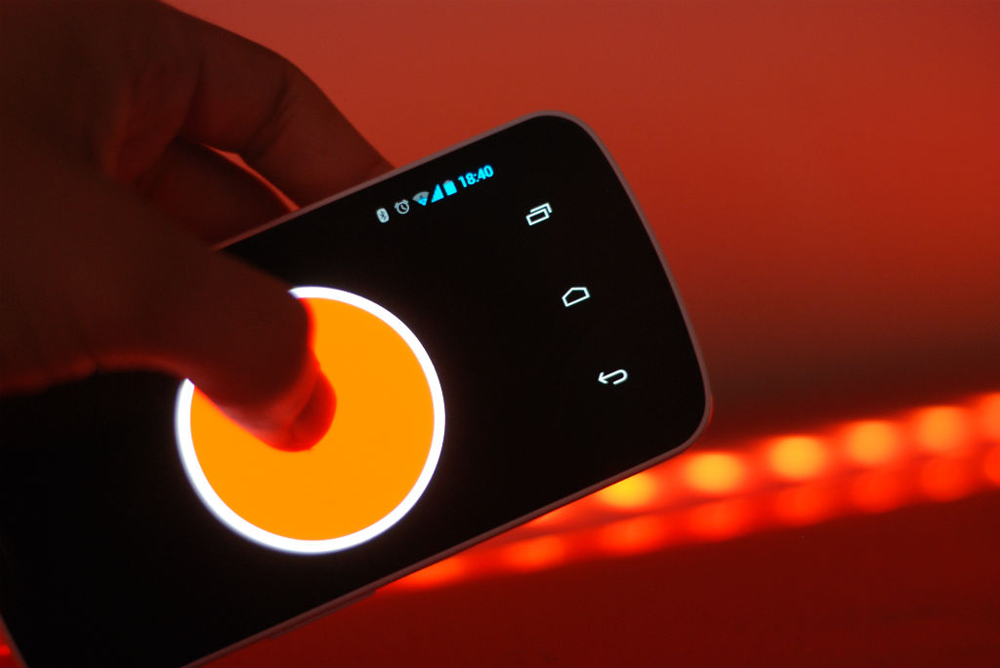

Title: Button: home automation made fun
Author: Will Haldean Brown
CSS: style.css

Button
======

Home automation made fun
------

[Button] is an interface for controlling the color and brightness of lights in
your home. It turns your Android device into a motion controller, where one
dimension is hue and the other is saturation.

The controller itself is independent of any hardware configuration; it sends
commands to a server which controls the lights themselves (in my system at home,
I use [dimsum][dimsum]). This architecture allows you to control your lights from
anywhere using the Button controller.

The real-time nature of the controller and the simple-to-understand mapping of
motion to color makes it possible to play Button like an instrument. Playing
music and making the lights pulse and change color with the beat is especially
satisfying.

You can download an APK from [Github].

### User Interface

The UI of Button is about as simple as it gets: it's just one big button.

As the user tilts their device to the left and right, the hue shown in the
circle changes. Tilting it 45 degrees with the left end down is red; as you tilt
it more to the right, it cycles through orange, yellow, green, blue, purple and
then back through to red at 45 degrees to the right.

While the user is moving the device, the lights themselves do not change. When
the user presses anywhere on the screen, though, the color on the screen gets
sent to the lights. The user can hold their finger on the screen as they move
the phone, and the lights will respond in real-time.

Tilting the device away from the user changes the value of the light. When the
phone is completely horizontal, the value goes to zero and the lights are off.
When the phone is tilted 45 degrees or more in relation to the ground, the
lights are at full. Again, the user can hold their finger on the screen and move
the phone forwards and backwards to set the brightness of the lights.

### Use it

Because it requires so much configuration outside just acquiring the app, I have
not tried to put Button up on the Play Market. You can download an APK from
[Github]. To use Button, you'll need:  
  
* RGB LEDs (I used [these from Adafruit][adafruit])
* an [Arduino][arduino]
* a machine that can run a web server (I use a [Raspberry Pi][rpi])
* an Android phone

First, wire up your LED strips as described [in this fantastic ladyada tutorial][tut]
and make sure your Arduino is working. Once that's up, download [dimsum] and
install the RgbSerial sketch included with it to your Arduino.

Now start up your light host (in my case, the Raspberry Pi but any computer with
a network connection will do) and fire up dimsum by running:
  
    $ python dimsum.py --dimmer /dev/ttyUSB0

You may need to change `ttyUSB0` to match the serial port that your Arduino is
running on. You may need to run it as root to allow it to bind to port 80, or
set the port to be over 1024 using the `--port` flag (recommended).

Finally, install the APK, go to the settings and set the address and port of
your light host. Make sure that the phone will be able to access this address;
if you're using an external IP, make sure your router is forwarding the correct
ports (the correct ports are whatever you set for the HTTP server _in addition
to_ port 9000, which is used for the socket connection).

If you don't want to forward ports, you can use the IP of your host on the LAN,
but you won't be able to control your lights if you aren't connected to your
home wifi.

[dimsum]: https://github.com/haldean/dimsum
[Button]: https://github.com/haldean/button
[Github]: https://github.com/haldean/button/downloads
[adafruit]: http://adafruit.com/products/285
[arduino]: http://www.arduino.cc/
[rpi]: http://raspberrypi.org/
[tut]: http://www.ladyada.net/products/rgbledstrip/
